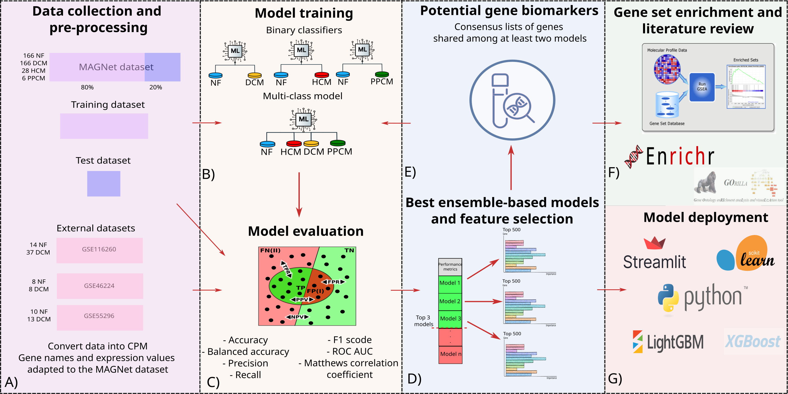
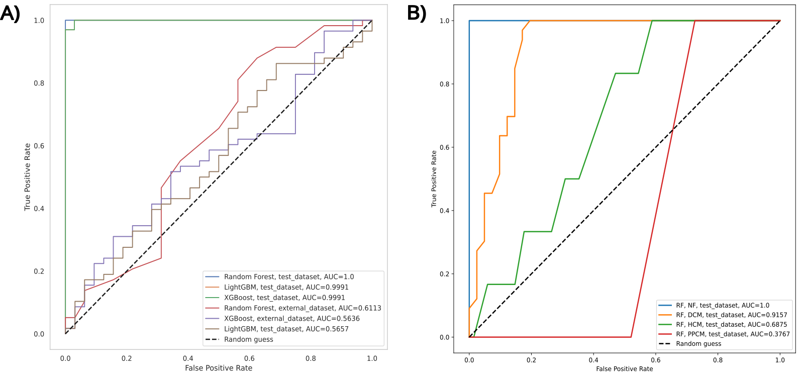
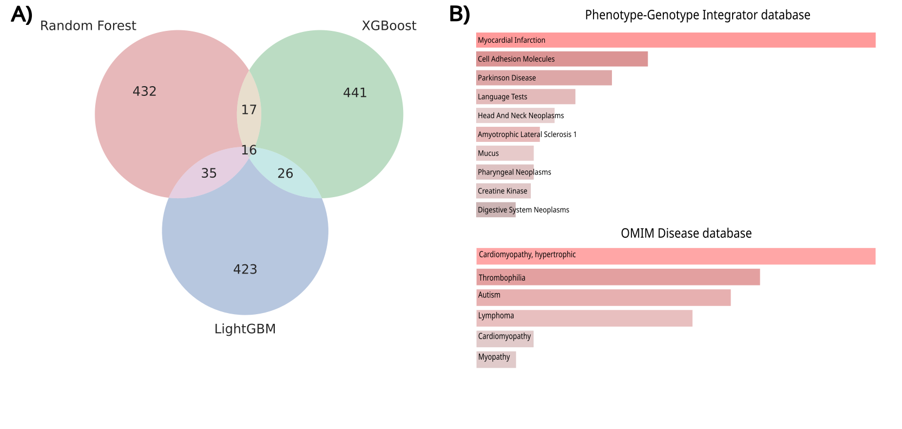

<h1 align="center">
    CardiomyoML
</h1>

    
    

   Classification of cardiomyopathies and prediction of new biomarkers with machine learning using RNA sequencing data

## Table of contents

- [About the project](#about-the-project)
- [Dataset](#dataset)
- [Methodology and Feature Selection](#methodology-and-feature-selection)
- [Machine Learning Models](#machine-learning-models)
- [Results of the best ML models](#results-of-the-best-ml-models)
- [Web Application](#web-application)
- [Structure of the repository](#structure-of-the-repository)
- [Credits](#credits)
- [Further details](#further-details)
- [Contact](#contact)

## About the project

Cardiomyopathies are morphological and functional abnormalities in the myocardium that affect millions of people worldwide. 
Despite a clear genetic component, characterizing the molecular signatures that distinguish different cardiomyopathy 
etiologies (dilated (DCM), hypertrophic (HCM), or peripartum (PPCM)) remains a significant challenge.

In this project, we developed **CardiomyoML**, a machine learning framework to classify heart tissue samples based 
on RNA-seq gene expression data. 

The main objectives were to:

1.  **Classify** samples into Non-failing (NF), DCM, HCM, or PPCM cardiomyopathies.
2.  **Identify** a robust set of genetic biomarkers using feature selection and consensus ranking.
3.  **Validate** the biological relevance of these genes through enrichment analysis and literature review.

  
   
  <em>Figure 1. Graphical abstract of the CardiomyoML workflow.</em>

## Dataset

The primary dataset for training and testing the ML models was the **Myocardial Applied Genomics Network (MAGNet)** (GSE141910). 
For validation, we used three external datasets (GSE46224, GSE116250, and E-GEOD-55296).

| Dataset partition | Samples | NF | DCM | HCM | PPCM |
| :--- | :---: | :---: | :---: | :---: | :---: |
| MAGNet (Training/Test) | 366 | 166 | 166 | 28 | 6 |
| External Validation 1 (GSE46224) | 16 | 8 | 8 | - | - |
| External Validation 2 (GSE116250) | 51 | 14 | 37 | - | - |
| External Validation 3 (GSE55296) | 10 | 13 | - | - | - |

## Feature Selection

The feature matrices were generated using log-transformed Counts Per Million (log-CPM) values. To handle the high dimensionality 
of RNA-seq data, we implemented a multi-stage feature selection process.

1.  **Ensemble Ranking:** Extracted the top 500 features from Random Forest, LightGBM, and XGBoost.
2.  **Consensus List:** Identified a list of **94 genes** consistently ranked high across all models.
3.  **Biological Validation:** Analyzed consensus genes (e.g., *MYH6*, *NPPA*) for Gene Ontology (GO) enrichment.

## Machine Learning Models

First, we tested more than 30 ML classifiers for the binary and multiclass classification tasks using the [LazyPredict][lazypredict] 
Python library. We chose the top 3 models according to some performance metrics such as accuracy, ROC AUC, precision, recall, F1 score, 
and Matthews Correlation Coefficient (MCC). Then, we fine-tuned the hyperparameters of the best models using sklearn's 
class [GridSearchCV][gridsearch]. Finally, considering the results of hyperparameter tuning and performance metrics, we obtained 
the best ML model to predict AMPs activity.

You can find the code for this part in the Jupyter notebooks in the root directory of the repository, one for each classification 
task (NF vs DCM, NF vs HCM, NF vs PPCM, and multiclass).

## Results of the best ML models

The models achieved high performance on internal test data, particularly in the NF/DCM task. However, performance 
significantly decreased when evaluated on external datasets.

 

    
     
    <em><b>Figure 2.</b> ROC curves of the top 3 ensemble-based-based models in A) the binary classification task of NF/DCM using test and external data and B) individual performances for each etiology in the multiclass classification task on test data.</em>

 

### **1. Binary Classification: NF/DCM (Test Data)**

| Metric | RF | LGBM | XGBoost |
| :--- | :---: | :---: | :---: |
| Accuracy | 0.99 | 0.99 | 0.97 |
| Balanced Accuracy | 0.99 | 0.99 | 0.97 |
| Precision | 0.97 | 0.97 | 0.94 |
| Recall | 1.00 | 1.00 | 1.00 |
| F1score | 0.99 | 0.99 | 0.97 |
| MCC | 0.97 | 0.97 | 0.94 |

### **2. Binary Classification: NF/HCM (Test Data)**

| Metric | Decision Tree | LGBM | XGBoost |
| :--- | :---: | :---: | :---: |
| Accuracy | 0.97 | 0.97 | 0.95 |
| Balanced accuracy | 0.92 | 0.92 | 0.83 |
| Precision | 1.00 | 1.00 | 1.00 |
| Recall | 0.83 | 0.83 | 0.67 |
| F1score | 0.91 | 0.91 | 0.80 |
| MCC | 0.90 | 0.90 | 0.79 |

### **3. Binary Classification: NF/PPCM (Test Data)**

| Metric | LGBM | AdaBoost | DecisionTree |
| :--- | :---: | :---: | :---: |
| Accuracy | 1.00 | 0.97 | 0.94 |
| Balanced accuracy | 1.00 | 0.99 | 0.97 |
| Precision | 1.00 | 0.50 | 0.33 |
| Recall | 1.00 | 1.00 | 1.00 |
| F1score | 1.00 | 0.67 | 0.50 |
| MCC | 1.00 | 0.70 | 0.56 |

### **4. External Validation: NF/DCM (External Data)**

| Metric | RF | LGBM | XGBoost |
| :--- | :---: | :---: | :---: |
| Accuracy | 0.66 | 0.52 | 0.62 |
| Balanced accuracy | 0.58 | 0.48 | 0.55 |
| Precision | 0.69 | 0.63 | 0.68 |
| Recall | 0.84 | 0.62 | 0.79 |
| F1score | 0.76 | 0.63 | 0.73 |
| MCC | 0.18 | -0.04 | 0.12 |

### **5. Multiclass Classification (Test Data)**

| Metric | RF | LGBM | XGBoost |
| :--- | :---: | :---: | :---: |
| Accuracy | 0.91 | 0.91 | 0.89 |
| Balanced accuracy | 0.50 | 0.53 | 0.49 |
| Precision | 0.83 | 0.91 | 0.82 |
| Recall | 0.91 | 0.91 | 0.89 |
| F1score | 0.86 | 0.88 | 0.85 |
| MCC | 0.84 | 0.84 | 0.82 |

## Biological Interpretation

Using the 500 most important genes from the top 3 ensemble models (RF, LGBM, and XGBoost) in the NF/DCM task, we identified **94 consensus genes** shared by at least two models, as shown in the Venn diagram in Figure 3A. 

* **Literature Comparison:** When compared against established literature datasets, only one gene, **MYH6** (myosin heavy chain 6), was shared. MYH6 is vital for cardiac muscle contraction, and its mutations are linked to cardiomyopathies and sudden cardiac death.
* **Enrichment Analysis:** GSE analysis using the **Enrichr** web server identified enriched ontologies related to myocardial infarction and HCM in the Phenotype-Genotype Integrator and OMIM Disease databases (Figure 3B). 

 

    
     
    <em><b>Figure 3.</b> A) Venn diagram of the top 500 most important genes for DCM. B) Gene set enrichment results associated with heart diseases obtained via Enrichr.</em>

 

## Web Application

We deployed the NF vs. DCM classifier as a Streamlit web applciation. Users can upload gene expression data for the 
94 consensus genes to receive a prediction.

* **Web App:**  
* **Web App Source Code:** [Web App Repository][app-repo]

## Structure of the repository

| Directory / File | Description |
| :--- | :--- |
| `*.ipynb` | Jupyter notebooks for data preprocessing, feature selection, model training, and evaluation. |
| [CardiomyoML_manuscript.pdf][manuscript] | Full research report and biological discussion. |
| `DataSet_Handler/` | Tools for handling and translating training datasets. |
| `External_Data/` | CPM conversion and fitting tools for external validation data. |
| `Go-enrichment/` | Scripts and results for Gene Ontology enrichment analysis. |
| `Results_important_genes/` | Consensus gene lists for DCM, HCM, PPCM, and multiclass models. |
| `Results_MLmodels/` | Performance metrics and trained model outputs. |
| `Literature_data/` | Collected research data for biological interpretation. |
| `images/` | Figures for the README and manuscript. |

## Credits

- Developed by [Sebastián Ayala Ruano](https://sayalaruano.github.io/), Sonia Bălan, Diego Rodríguez, and Rodrigo Sánchez. 
This work was developed for the first project period of the [MSc in Systems Biology][sysbio] at [Maastricht University][maasuni].

## Further details

The [PDF Manuscript][manuscript] contains more background information on cardiomyopathies, a detailed description of the methodology, and an in-depth discussion of the results.

## Contact

If you have comments or suggestions, please [open an issue][issues] in this repository. 

---

[web-app]: https://rnaseq-cardiomyopathies-pred.streamlit.app/
[app-repo]: https://github.com/sayalaruano/RNAseq_cardiomyopathies_pred
[manuscript]: CardiomyoML_manuscript.pdf
[lazypredict]: https://github.com/shankarpandala/lazypredict
[gridsearch]: https://scikit-learn.org/stable/modules/generated/sklearn.model_selection.GridSearchCV.html
[sysbio]: https://www.maastrichtuniversity.nl/education/master/systems-biology
[maasuni]: https://www.maastrichtuniversity.nl/
[issues]: https://github.com/sayalaruano/CardiomyoML/issues/new